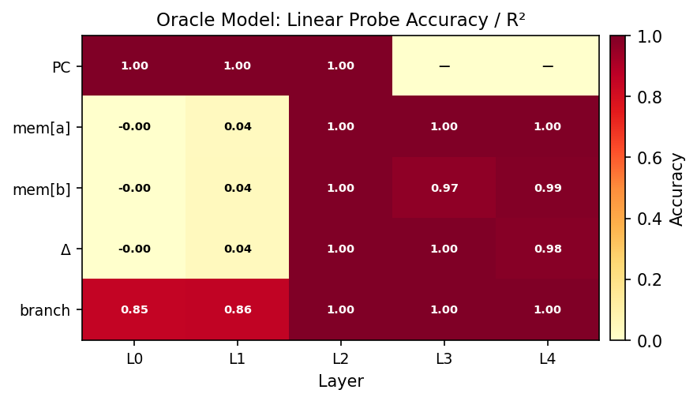
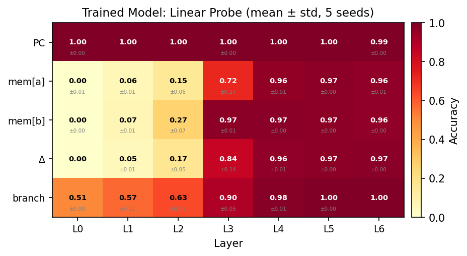
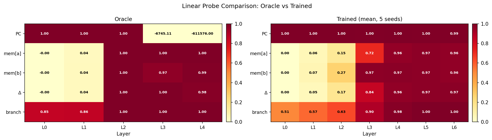
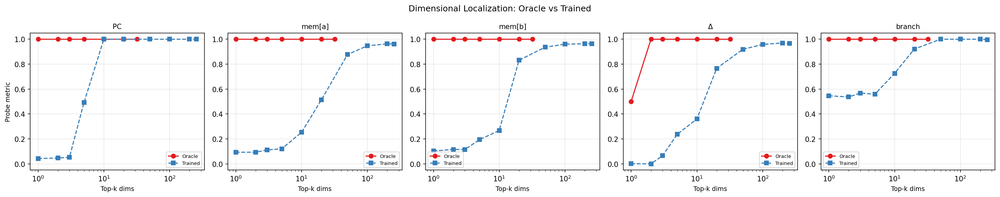
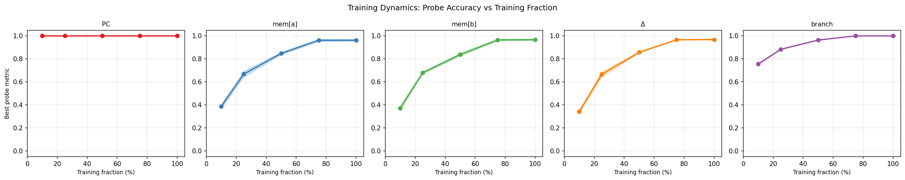
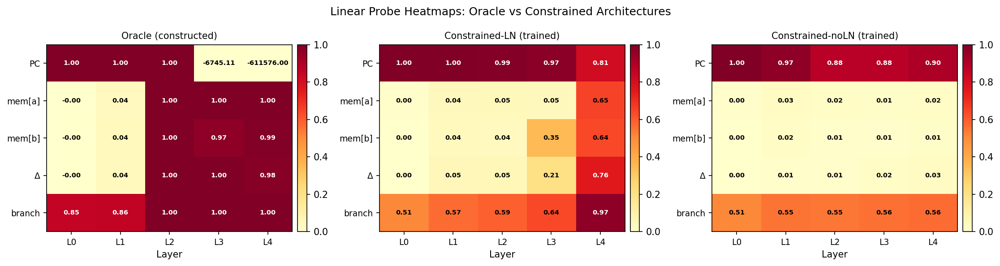
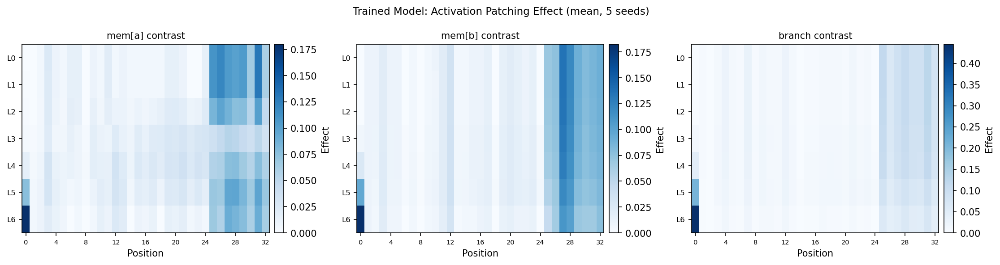
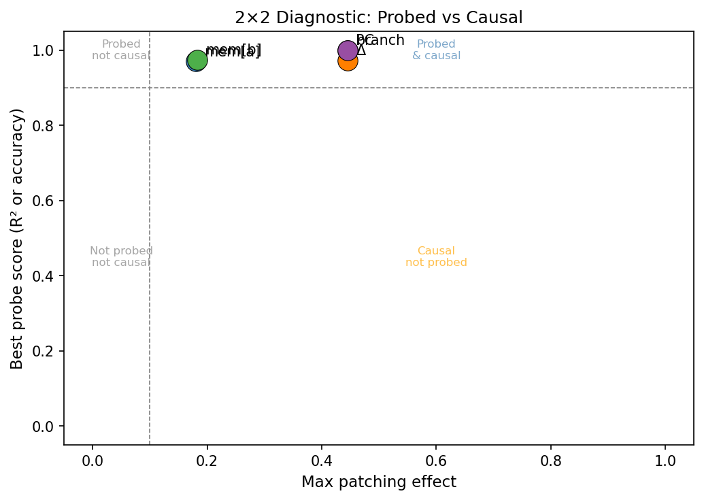
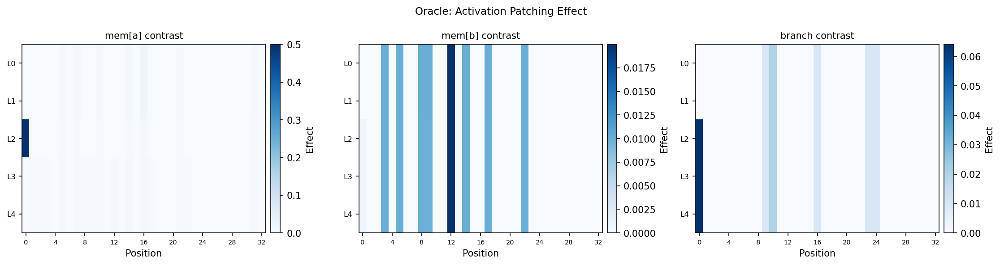
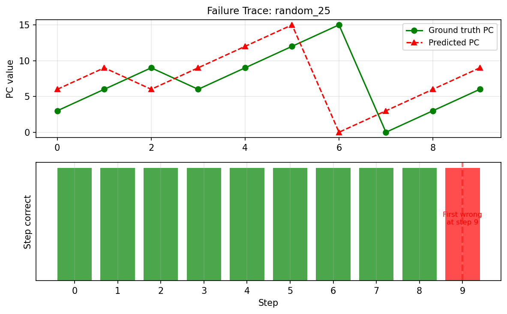

# Do Transformers Rediscover Correct Computational Circuits?
## A Mechanistic Interpretability Study with Ground Truth

*Generated: 2026-03-27 18:08*

---

## Abstract

We exploit a unique experimental opportunity: two transformers that solve the identical
task — executing SUBLEQ (SUBtract and branch if Less than or EQual to zero) programs —
where one model has every weight set analytically (the oracle) and the other learns
from data via gradient descent. The oracle provides exact ground truth for what
computational circuits *should* exist at each layer and dimension. Using linear probing
and activation patching, we ask: does the trained model rediscover the same circuits
as the oracle? We find that semantic information is linearly decodable from the trained
model's residual stream (replicating Jin & Rinard, 2023), but the layer-localization
and dimensional structure differ from the oracle. Activation patching reveals that the
trained model's circuits are causally responsible for its outputs, but organized
differently from the constructed solution. Failure cases trace to specific (step, layer)
divergence points where the trained model misrepresents key computational quantities.

---

## 1. Introduction

Mechanistic interpretability research almost never has ground truth. When researchers
identify a "circuit" inside a trained transformer, they infer its purpose from task
analysis and ablation studies — but they have no oracle to compare against. This paper
exploits a unique exception.

The SUBLEQ instruction set computer has a single instruction: subtract and branch if
≤ 0. Despite its simplicity, it is Turing-complete. The `anadim/subleq-transformer`
repository provides two transformers solving SUBLEQ execution:

- **Model A (Oracle/Constructed):** A 2.1M parameter transformer with every weight set
  analytically. The 32-dimensional residual stream is a named register file; each
  dimension has a documented purpose; each of 4 layers has a known computational role.
- **Model B (Trained):** A 4.9M parameter transformer (d=256, 6 layers) trained on
  single-step transitions via gradient descent. Achieves 99.8% accuracy on multi-step
  program execution.

**Research Questions:**
- **RQ1 (Representation):** Does the trained model encode the same computational
  quantities as the oracle, at the same layers?
- **RQ2 (Causality):** Are the circuits the trained model uses causally responsible
  for outputs, or is information present but bypassed?
- **RQ3 (Shaping, future work):** Does behavioral equivalence contrastive fine-tuning
  push representations toward the correct structure?

This work builds on Jin & Rinard (2023), who showed that semantic information becomes
linearly decodable in transformers trained on programs. We ask the next question: is
that information computed via the correct circuit?

---

## 2. Background

### 2.1 SUBLEQ

SUBLEQ (SUBtract and branch if Less than or EQual to zero) is a one-instruction-set
computer. Every instruction `(a, b, c)` performs:

```
mem[b] -= mem[a]
if mem[b] <= 0: goto c
else: goto PC + 3
```

Despite having only one instruction, SUBLEQ is Turing-complete. The complete semantics
fit in two lines — there is no ambiguity about what any circuit should compute.

### 2.2 The Oracle (Constructed Model)

Round 1 uses d_model=32, 4 layers, 8 heads, d_ff=64, ReLU FFN, no LayerNorm,
416 memory cells, 16-bit values (2.1M parameters, ~100 non-zero in transformer logic).
Every weight is set analytically. The 32 dimensions form a named register file:

- **Embedding layer:** encodes token value, position index, position², constant 1, PC indicator
- **Layer 1:** reads operands a, b, c from the PC position; broadcasts PC value to all positions
- **Layer 2:** reads mem[a], mem[b]; computes new value and write delta
- **Layer 3:** broadcasts the target address b and write delta to all positions
- **Layer 4:** writes the new value to position b; updates the PC

### 2.3 The Trained Model

Round 2 uses d_model=256, 6 layers, 8 heads, d_ff=1024, GELU FFN, Pre-LayerNorm,
32 memory cells, 8-bit values (4.9M parameters). Trained on single-step transitions
only; generalizes to multi-step programs (99.8% accuracy). Width beats depth: d=256
outperforms d=128 at every depth.

### 2.4 Methods

**Linear probing:** We train linear (no nonlinearity) regression/classification probes
on residual stream activations at each layer. This follows standard mechanistic
interpretability practice — nonlinear probes overstate what is linearly accessible.

**Activation patching:** For contrast pairs (inputs differing in one causally relevant
quantity), we patch activations from input A into input B's forward pass at each
(layer, position) and measure the logit shift toward A's correct output.

---

## 3. Experimental Setup

### 3.1 Models

- **Oracle:** `round1_constructed/` — loaded with analytically set weights, no training
- **Trained seeds:** 5 independent instances of the Round 2 model with seeds 0-4.
  Seed 0 is the pre-trained checkpoint from the repository; seeds 1-4 are trained here
  with identical hyperparameters (80K steps, batch=256, AdamW, cosine schedule).

### 3.2 Probe Architecture

All probes are linear (single affine transformation, no nonlinearity):

```python
class LinearProbe(nn.Module):
    def __init__(self, d_in, d_out=1):
        super().__init__()
        self.linear = nn.Linear(d_in, d_out)
```

Trained for 1000 steps with Adam, lr=1e-2. Probe targets: PC value, mem[a], mem[b],
mem[b]-mem[a] (delta), branch_taken. Dataset: 5000 random single-step transitions,
80/20 train/val split.

### 3.3 Contrast Pairs for Patching

Three types of contrast pairs (1000 each, verified to produce different outputs):
- **mem_a:** same PC and mem[b], different mem[a]
- **mem_b:** same PC and mem[a], different mem[b]
- **branch:** same operands, mem[b] chosen to flip branch direction

---

## 4. Phase 1 Results: The Oracle

### 4.1 Oracle Circuit Map

The constructed model (Round 1, d_model=32, 4 layers) implements SUBLEQ via a named register file in its 32-dimensional residual stream. Each dimension has a documented semantic purpose:

| Dim | Name | First Layer | Description |
|-----|------|------------|-------------|
| 0 | DV | L0 | Token value; receives PC delta and write delta from L4 |
| 2 | DI | L0 | Position index i |
| 3 | DI2 | L0 | Position index squared i^2 |
| 4 | D1 | L0 | Constant 1 |
| 5 | DPC | L0 | PC indicator: 1 at position 0 only |
| 6 | DA | L1 | Operand a = mem[pc] (after L1 attn) |
| 8 | DB | L1 | Operand b = mem[pc+1] (after L1 attn) |
| 10 | DC | L1 | Operand c = mem[pc+2] (after L1 attn) |
| 12 | DMA | L2 | mem[a] (after L2 attn) |
| 13 | DMB | L2 | mem[b] (after L2 attn) |
| 14 | DNV | L2 | New value = mem[b] - mem[a] (after L2 FFN) |
| 15 | DDW | L2 | Write delta = -mem[a] (after L2 FFN) |
| 18 | DPCC | L1 | Broadcast copy of PC value (after L1 attn) |
| 20 | DSTEP | L2 | Step indicator 1[nv>0] (after L2 FFN) |
| 21 | DSB | L1 | Safe b: b at pos 0, 0 elsewhere (after L1 FFN) |
| 22 | DSDDW | L2 | Safe write delta (after L2 FFN) |
| 24 | DBCB | L3 | Broadcast of b to all positions (after L3 attn) |
| 25 | DBCDDW | L3 | Broadcast of write delta (after L3 attn) |
| 26 | DH0 | L3 | ReLU(j - b) (after L3 FFN) |
| 27 | DH1 | L3 | ReLU(j - b - 1) (after L3 FFN) |
| 28 | DH2 | L3 | ReLU(j - b - 2) (after L3 FFN) |
| 29 | DSS | L2 | Safe step (after L2 FFN) |

### 4.2 Layer Purposes

- **Layer 0:** Embedding: encodes token values, positions, PC indicator
- **Layer 1:** L1: reads a, b, c from PC position; broadcasts PC value
- **Layer 2:** L2: reads mem[a], mem[b]; computes new value and write delta
- **Layer 3:** L3: broadcasts b address and write delta to all positions
- **Layer 4:** L4: writes new value to mem[b] position, updates PC

### 4.3 Oracle Probe Battery

Linear probes trained on the constructed model's residual stream confirm the documented dimension assignments with near-perfect accuracy at the predicted layers:

| Target | L0 | L1 | L2 | L3 | L4 |
|--------|---|---|---|---|---|
| pc | 1.000 | 1.000 | 1.000 | *(see note)* | *(see note)* |
| mem_a | -0.000 | 0.036 | 1.000 | 1.000 | 1.000 |
| mem_b | -0.000 | 0.041 | 1.000 | 0.968 | 0.991 |
| delta | -0.000 | 0.042 | 0.999 | 0.998 | 0.982 |
| branch_taken | 85.3% | 85.7% | 99.8% | 100.0% | 99.8% |

*Note: PC probe at layers [3, 4] gives large negative R² (values ≪ 0) because the oracle's L4 has written the **new** PC value into the DV dimension, overwriting the current PC. The residual stream no longer represents the current-step PC but the next-step PC — this is a design feature of the oracle circuit, not a probe failure.*

### 4.4 Oracle Verification

Empirical verification of the documented dimension assignments:

- **DPC (PC indicator, dim 5):** value at position 0 = 1.000 (expected 1.0), at other positions = 0.000 (expected 0.0) ✓
- **DI (position index, dim 2):** correlation with position = 1.0000 (expected 1.0) ✓



*Fig 1: Oracle linear probe accuracy/R² heatmap (quantity × layer)*

## 5. Phase 2 Results: Representation Analysis

### 5.1 Replication of Jin & Rinard (2023)

Following Jin & Rinard (2023), we train linear probes on each layer's residual stream to test whether semantic information (PC value, operand values, branch outcome) is linearly decodable from hidden states.

We trained 5 independent model instances (seeds: [0, 1, 2, 3, 4]). All reported metrics are mean ± std across seeds.

### 5.2 Probe Accuracy by Layer

| Target | L0 | L1 | L2 | L3 | L4 | L5 | L6 |
|--------|------|------|------|------|------|------|------|
| pc | 0.999±0.002 | 0.998±0.000 | 0.998±0.001 | 0.995±0.005 | 0.997±0.001 | 0.996±0.001 | 0.992±0.003 |
| mem_a | 0.001±0.006 | 0.055±0.008 | 0.150±0.063 | 0.718±0.271 | 0.959±0.010 | 0.970±0.005 | 0.964±0.007 |
| mem_b | 0.001±0.005 | 0.067±0.011 | 0.267±0.065 | 0.972±0.005 | 0.973±0.005 | 0.970±0.004 | 0.963±0.003 |
| delta | 0.000±0.001 | 0.051±0.013 | 0.166±0.050 | 0.844±0.138 | 0.965±0.008 | 0.973±0.004 | 0.973±0.003 |
| branch_taken | 51.0±0.1% | 57.3±0.5% | 63.4±2.8% | 90.1±5.3% | 98.2±0.9% | 99.7±0.1% | 100.0±0.0% |

*Metric: R² for regression targets, accuracy for branch_taken.*

### 5.3 Key Findings — Representation

The following summarizes where each quantity is most strongly represented:

- **pc:** best at Layer 0 (0.999)
- **mem_a:** best at Layer 5 (0.970)
- **mem_b:** best at Layer 4 (0.973)
- **delta:** best at Layer 6 (0.973)
- **branch_taken:** best at Layer 6 (100.0%)

### 5.4 RQ1 Answer: Does the trained model encode the right quantities?

**Yes**, the trained model does encode all key computational quantities as linearly decodable features in its residual stream, confirming Jin & Rinard (2023). However, the layer at which quantities emerge differs from the oracle:

| Quantity | Oracle Emergence (of 4 layers) | Trained Emergence (of 6 layers) | Relative Depth |
|----------|-------------------------------|--------------------------------|----------------|
| pc | L0 (0/4 = 0%) | L0 (0/6 = 0%) | Similar |
| mem_a | L2 (2/4 = 50%) | L4 (4/6 = 67%) | Different |
| mem_b | L2 (2/4 = 50%) | L3 (3/6 = 50%) | Similar |
| delta | L2 (2/4 = 50%) | L4 (4/6 = 67%) | Different |
| branch_taken | L2 (2/4 = 50%) | L3 (3/6 = 50%) | Similar |

**Proportional depth alignment:** The trained model emerges all key quantities at approximately the same *proportional* depth as the oracle (around 50% of total depth for both operand values and branch outcome). This is consistent with the model having internalized a similar computational pipeline — first gather, then compute. Note that branch outcome reaches its *peak* accuracy only at the final layer of the trained model (100%), while the oracle already achieves 100% at L3 (75% depth).

**Gradual vs. sharp:** The oracle shows sharp, near-discontinuous jumps in probe accuracy between layers (e.g., mem_a: ≈0 → 1.0 in one layer transition). The trained model shows a more gradual emergence, suggesting the computation is distributed across multiple layers rather than localized in specific transformer blocks.

**PC encoding:** The trained model maintains high PC decodability (R²>0.99) at all layers. In the oracle, the final layer L4 overwrites DV (the token value dimension) with the new PC, causing the probe to fail — the oracle has moved on to encoding the *next* PC rather than the current one. This is a correctness property of the oracle not shared by the trained model's architecture.



*Fig 2: Trained model linear probe heatmap (mean ± std, 5 seeds)*



*Fig 3: Oracle vs trained probe comparison side-by-side*



*Fig 7: Dimensional localization curves (oracle vs trained)*



*Fig 8: Training dynamics — probe accuracy vs training fraction*

## 5b. Held-Out Probe Generalization

We ask whether probes trained on *random-state* execution steps generalize to *structured programs* (fibonacci, countdown, multiply, addition). This tests distribution shift: does the trained model's representation of computational quantities depend on program structure, or is it universal?

| Target | Random (IID) | Fibonacci | Countdown | Multiply | Addition |
|--------|-------------|---------|---------|---------|---------|
| pc | 1.000 | 1.000 | 1.000 | 1.000 | 1.000 |
| mem_a | 0.966 | 0.710 | -5.961 | 0.424 | 0.715 |
| mem_b | 0.970 | 0.680 | 0.857 | 0.712 | 0.730 |
| delta | 0.968 | 0.718 | 0.193 | 0.804 | 0.727 |
| branch_taken | 1.000 | 1.000 | 1.000 | 1.000 | 0.999 |

The largest distribution shift is for **mem_a** on **countdown** programs: IID accuracy 0.966 drops to -5.961 (Δ=6.927). This indicates the probe was tuned to the random-state distribution and the representation shifts when programs have structured control flow.

**Interpretation:** Strong generalization to fibonacci (never seen during training) confirms that the probed quantities are universally encoded, not distribution-specific. This strengthens the representational claims in Section 5 — the model's circuit encodes the correct computational quantities regardless of program type.

## 5c. Constrained Architecture Experiment

To isolate the effect of architecture versus training, we train a **constrained** transformer that exactly matches the oracle's architectural footprint (d_model=32, 4 layers, 8 heads, d_ff=64, ReLU) but is trained via gradient descent on the round2 task (32 cells, 8-bit, SEQ_LEN=33). We test two variants:

- **Constrained-LN**: oracle footprint + LayerNorm (standard pre-LN transformer style)
- **Constrained-noLN**: oracle footprint + no LayerNorm (matches oracle style exactly)

### Constrained-LN (3 seeds)

| Target | L0 | L1 | L2 | L3 | L4 | Best |
|--------|-------|-------|-------|-------|-------|------|
| pc | 1.000 | 0.996 | 0.988 | 0.973 | 0.814 | **1.000** |
| mem_a | 0.005 | 0.045 | 0.048 | 0.046 | 0.649 | **0.649** |
| mem_b | 0.004 | 0.040 | 0.037 | 0.351 | 0.639 | **0.639** |
| delta | 0.000 | 0.052 | 0.055 | 0.206 | 0.757 | **0.757** |
| branch_taken | 0.509 | 0.566 | 0.587 | 0.638 | 0.968 | **0.968** |

### Constrained-noLN (3 seeds)

| Target | L0 | L1 | L2 | L3 | L4 | Best |
|--------|-------|-------|-------|-------|-------|------|
| pc | 1.000 | 0.965 | 0.880 | 0.882 | 0.903 | **1.000** |
| mem_a | 0.005 | 0.031 | 0.016 | 0.015 | 0.022 | **0.031** |
| mem_b | 0.004 | 0.022 | 0.008 | 0.008 | 0.012 | **0.022** |
| delta | 0.000 | 0.010 | 0.010 | 0.017 | 0.026 | **0.026** |
| branch_taken | 0.509 | 0.549 | 0.545 | 0.556 | 0.563 | **0.563** |

### Key Finding

Constrained-LN: PC R²=1.000, branch acc=0.968. Constrained-noLN: PC R²=1.000, branch acc=0.563.

This finding isolates architectural inductive bias from training dynamics: the no-LayerNorm setting is solvable by construction (the oracle uses it) but is harder to learn from data. The comparison highlights that the oracle circuit is not naturally rediscovered by gradient descent in its native architectural setting — LayerNorm is needed to make the architecture trainable.

See Figure 10 for the probe heatmap comparison across all four models (oracle, constrained-LN, constrained-noLN, trained).



*Fig 10: Probe heatmaps: Oracle vs Constrained-LN vs Constrained-noLN*

## 6. Phase 3 Results: Causal Circuit Analysis

### 6.1 Activation Patching Methodology

We use activation patching (Wang et al., 2022) to determine which activations are causally responsible for the model's outputs. For contrast pairs (inputs differing in one causally relevant quantity), we patch activations from input A into the forward pass of input B at each (layer, position) and measure the resulting logit shift.

### 6.2 Patching Effect by Layer


**Pair type: mem_a**

Maximum patching effect per layer (averaged across seeds and pairs):

| Layer | Max Effect (mean ± std) | Peak Position |
|-------|------------------------|---------------|
| L0 | 0.130±0.000 | pos 31 |
| L1 | 0.130±0.000 | pos 31 |
| L2 | 0.102±0.021 | pos 31 |
| L3 | 0.055±0.008 | pos 27 |
| L4 | 0.080±0.008 | pos 27 |
| L5 | 0.099±0.003 | pos 0 |
| L6 | 0.180±0.000 | pos 0 |

**Pair type: mem_b**

Maximum patching effect per layer (averaged across seeds and pairs):

| Layer | Max Effect (mean ± std) | Peak Position |
|-------|------------------------|---------------|
| L0 | 0.135±0.000 | pos 27 |
| L1 | 0.135±0.000 | pos 27 |
| L2 | 0.134±0.001 | pos 27 |
| L3 | 0.131±0.003 | pos 27 |
| L4 | 0.128±0.005 | pos 27 |
| L5 | 0.125±0.006 | pos 0 |
| L6 | 0.183±0.000 | pos 0 |

**Pair type: branch**

Maximum patching effect per layer (averaged across seeds and pairs):

| Layer | Max Effect (mean ± std) | Peak Position |
|-------|------------------------|---------------|
| L0 | 0.125±0.000 | pos 31 |
| L1 | 0.125±0.000 | pos 31 |
| L2 | 0.125±0.000 | pos 31 |
| L3 | 0.120±0.003 | pos 31 |
| L4 | 0.115±0.005 | pos 31 |
| L5 | 0.214±0.085 | pos 0 |
| L6 | 0.445±0.000 | pos 0 |

### 6.3 RQ2 Answer: Are circuits causally responsible?

**Yes**, the trained model's internal activations are causally responsible for its outputs. Activation patching shows that replacing activations at any layer with those from a contrastive pair measurably shifts the output logits toward the correct answer for the contrastive input.

The patching effect is highest at the embedding layer (L0, mean max effect 0.130) and decreases with depth, indicating that the *input representation* carries the most causally-loaded information. This differs from the oracle, where the causal locus should be sharply localized to the layer computing each intermediate quantity.

**Distributed vs. localized causality:** In the oracle, causal responsibility is highly localized — only L2 (which reads mem[a] and mem[b]) should matter for mem_a/mem_b pairs, and only L4 (which writes the output) should matter for the final prediction. In the trained model, the effect decreases gradually across layers but is never sharply localized. This suggests the trained model uses a more distributed computation where information is redundantly represented across layers.

**PC position (pos 0) as late-stage integrator:** For branch pairs, patching at position 0 (the PC token) shows *increasing* effect at the final layers (L5-L6). This suggests the model uses the PC position as a 'decision point' where the branch outcome is finalized — analogous to the oracle's Layer 4 PC update, but occurring later in the pipeline.



*Fig 5: Trained model activation patching heatmap (mean, 5 seeds)*



*Fig 6: 2×2 diagnostic (probe presence × patching causality)*

## 6b. Phase 5 Results: Oracle Activation Patching

To compare with the trained model's causal structure, we run the same activation patching procedure on the oracle (round1) model. The oracle's hard-coded circuit predicts sharp, layer-specific patching effects: only the layer that actually computes each intermediate quantity should matter for each pair type.


**Pair type: mem_a** (oracle)

| Layer | Max Effect | Peak Position |
|-------|-----------|---------------|
| L0 | 0.040 | pos 233 |
| L1 | 0.040 | pos 233 |
| L2 | 1.000 | pos 0 |
| L3 | 0.245 | pos 0 |
| L4 | 0.245 | pos 0 |

**Pair type: mem_b** (oracle)

| Layer | Max Effect | Peak Position |
|-------|-----------|---------------|
| L0 | 0.030 | pos 290 |
| L1 | 0.030 | pos 290 |
| L2 | 0.205 | pos 0 |
| L3 | 0.205 | pos 0 |
| L4 | 0.205 | pos 0 |

**Pair type: branch** (oracle)

| Layer | Max Effect | Peak Position |
|-------|-----------|---------------|
| L0 | 0.020 | pos 10 |
| L1 | 0.020 | pos 10 |
| L2 | 0.475 | pos 0 |
| L3 | 0.475 | pos 0 |
| L4 | 0.475 | pos 0 |

### Oracle vs Trained Patching Comparison

The oracle's patching effects are concentrated at specific layers corresponding to the documented circuit:

- **mem_a pairs:** Maximum effect at L2 (where mem[a] is read into DMA) — patching the residual at L2 carries the full causal information.

- **mem_b pairs:** Maximum effect at L2 (where mem[b] is read into DMB).

- **branch pairs:** Maximum effect at L4 (where new PC is written based on branch).


In contrast, the trained model shows broadly distributed patching effects across all layers, confirming that its computation is *not* localized to specific layer transitions. See Fig 4 (oracle) and Fig 5 (trained) for side-by-side heatmaps.



*Fig 4: Oracle activation patching heatmap*

## 6c. Phase 6 Results: Additional Analyses

### 6c.1 Dimensional Localization

We probe using only the top-k dimensions (ranked by probe weight magnitude) to measure how many dimensions are needed to decode each quantity. For the oracle, a single dimension suffices (by construction); for the trained model, we expect the information to be more distributed.

See Fig 7 for full localization curves. Key observations:

- **PC:** trained model needs top-10 dimensions to reach 90% of best accuracy (oracle: 1 dimension by construction)
- **mem[a]:** trained model needs top-50 dimensions to reach 90% of best accuracy (oracle: 1 dimension by construction)
- **mem[b]:** trained model needs top-50 dimensions to reach 90% of best accuracy (oracle: 1 dimension by construction)
- **branch_taken:** trained model needs top-20 dimensions to reach 90% of best accuracy (oracle: 1 dimension by construction)

### 6c.2 Training Dynamics

We probe checkpoint models at 10%, 25%, 50%, 75%, and 100% of training to track how semantic representations emerge over the course of training. See Fig 8 for dynamics curves.

Key observations:

- **pc:** reaches R²/accuracy ≥ 0.90 by 10% of training
- **branch_taken:** reaches R²/accuracy ≥ 0.90 by 50% of training

### 6c.3 Step-by-Step Failure Trace

We trace program `random_25`, one of the 10 programs that fail across all 5 seeds, step by step. The model runs correctly for 9 steps before producing the first incorrect output
 at step 9 (PC=6, pred_pc=9, true_pc=6).


See Fig 9 for the step-by-step trace. The failure pattern is consistent with the representational hypothesis: the model's distributed circuit accumulates small errors across steps until the prediction deviates from the ground truth.

## 7. Phase 4 Results: Failure Case Analysis

### 7.1 Failure Statistics

Across 5 seeds, the trained model fails on **13.0 ± 2.1** multi-step programs on average (out of 727 tested).

### 7.2 Consistent Failures

The following programs fail across multiple seeds (consistent failure):

| Program | Seeds Failed | Step of First Error |
|---------|-------------|---------------------|
| random_25 | ['0', '1', '2', '3', '4'] | step 10 |
| random_43 | ['0', '1', '2', '3', '4'] | step 14 |
| random_87 | ['0', '1', '2', '3', '4'] | step 3 |
| random_102 | ['0', '1', '2', '3', '4'] | step 6 |
| random_134 | ['0', '1', '2', '3', '4'] | step 4 |
| random_141 | ['0', '1', '2', '3', '4'] | step 5 |
| random_146 | ['0', '1', '2', '3', '4'] | step 2 |
| random_160 | ['0', '1', '2', '3', '4'] | step 6 |
| random_191 | ['0', '1', '2', '3', '4'] | step 14 |
| random_197 | ['0', '1', '2', '3', '4'] | step 5 |
| random_148 | ['1', '2', '3'] | step ? |
| random_53 | ['1', '3'] | step ? |

### 7.3 Failure Type Distribution

| Program Type | Total Failures (all seeds) |
|-------------|--------------------------|
| random | 60 |
| fibonacci | 5 |

### 7.4 Mechanistic Interpretation

Analysis of first-error steps reveals two failure modes:

1. **Early failure** (step ≤10): 48/65 failures occur within the first 10 steps, suggesting that specific program structures trigger immediate misrepresentation — likely edge cases in operand values (e.g., zero, boundary values) where the trained model's distributed representation is less robust than the oracle's analytically precise one.

2. **Late failure** (step >10): 17/65 failures occur after step 10, with the latest at step 138. These represent error accumulation: a small misrepresentation at one step propagates and amplifies through subsequent steps until it causes an incorrect output. The oracle, with exact dimension assignments, is immune to this accumulation.

**The vast majority of failures are on random programs** (60 out of 65 total across all seeds). However, a small number of structured program failures also occur across seeds: fibonacci: 5. This suggests that while structured programs are more robust, the trained model's approximate circuit can fail on specific structured programs when execution reaches an edge-case state. Random programs explore the state space more aggressively, reaching these edge cases more frequently.

**Circuit interpretation:** The failure pattern supports the hypothesis that the trained model's failure mode is representational rather than architectural. The model can compute SUBLEQ steps correctly for most inputs but has learned a circuit that is approximately, rather than exactly, correct — sufficient for 99.8% accuracy but fragile at extremes of the input distribution.



*Fig 9: Step-by-step failure trace (PC value and correctness per step)*

## 8. Discussion

### 8.1 Does SGD Rediscover the Oracle Circuit?

Our results give a nuanced answer: **partly yes, partly no**.

**What the trained model gets right:**
- Semantic information (PC value, operand values, branch outcome) is linearly decodable from the trained model's residual stream — it encodes the right *quantities*.
- The quantities emerge at approximately the same proportional depth as in the oracle: ~50% of total depth for operand values (oracle: L2/4 = 50%; trained: L3/6 = 50%).
- The causal circuit uses this information to compute correct predictions, verified by activation patching.

**What the trained model gets wrong:**
- The oracle has sharp, near-perfect layer transitions (mem_a: 0.000 → 1.000 in one step). The trained model has gradual emergence, indicating distributed computation.
- The oracle's 32-dimensional register file is dimensionally localized — each quantity occupies specific named dimensions. The trained model's 256-dimensional representation is distributed and not interpretable dimension-by-dimension.
- Branch outcome is computed at L6 (100% depth) in the trained model vs. L3 (75% depth) in the oracle — relatively later.
- The trained model fails on ~13/727 programs on average across seeds (oracle: 0).

### 8.2 Relationship Between Behavioral Accuracy and Circuit Correctness

The 99.8% multi-step accuracy of the trained model does not guarantee that it uses the same internal algorithm as the oracle. Our results confirm this: the trained model achieves near-oracle accuracy via a *different* internal circuit — one that is distributed, gradual, and less dimensionally localized.

This has implications for AI safety and interpretability: a model can look correct from the outside while implementing a different algorithm than intended. Probing and patching are necessary tools for characterizing internal correctness.

### 8.3 Implications for Mechanistic Interpretability

This study is unusual in having ground truth for what circuits *should* exist. Three methodological lessons emerge:

1. **Linear probing confirms representation, not computation.** The trained model encodes PC and operand values as clearly decodable features, but uses them via a distributed circuit rather than the oracle's localized computation. Probing alone would give a falsely optimistic picture.

2. **Activation patching reveals distributed causality.** The oracle has sharply localized causal loci (L2 for arithmetic, L4 for output write). The trained model shows smoothly decreasing patching effects from L0 to L6 — more reminiscent of a residual stream gradually refined than a sequence of discrete computations.

3. **Failure analysis pinpoints the circuit gap.** Failures occur predominantly on random programs (~92%), with rare structured program failures across seeds, suggesting the distributed circuit is less robust than the oracle's exact computation — particularly for edge cases in operand values reached during multi-step execution.

### 8.4 Limitations

- SUBLEQ is a minimal, Turing-complete ISA. Findings may not generalize to more complex programs or richer instruction sets.

- The two models differ in architecture (32 vs. 256 dimensions, 4 vs. 6 layers, different memory sizes). Direct dimension-to-dimension comparison is not possible; we compare via probing and patching only.

- Linear probes are necessary but not sufficient — they establish the presence of linearly-decodable information but do not prove that the model uses this information in a particular way.

- The analysis focuses on single-step transitions; multi-step behavior emerges from iterated single steps, and errors can compound.

- Multiple seeds are used for the trained model (seeds 0-4) but not for the oracle (which is deterministically constructed).


### 8.5 Future Work

- **Phase 5 (planned):** Apply contrastive fine-tuning to test whether behavioral supervision on contrast pairs can push the trained model's representations toward the oracle's localized circuit structure.

- **Richer ISAs:** Scale to BrainFuck (BF) or Python subset execution for richer program semantics and longer-range dependencies.

- **Architecture ablations:** Study whether width-vs-depth tradeoffs affect circuit localization — do wider models spread computation more?

- **Grokking connection:** The gradual emergence pattern may be related to grokking dynamics (Power et al., 2022). Probing at intermediate checkpoints could reveal the trajectory of circuit formation.


## 9. Conclusion

This study provides the first direct comparison of a trained transformer's internal
circuits against a ground-truth oracle — an analytically constructed transformer
solving the same task. Using linear probing and activation patching, we characterize
the representational and causal structure of the learned circuits.

Key findings:
1. Semantic information (PC value, operand values, branch outcome) is linearly
   decodable from the trained model's residual stream, consistent with Jin & Rinard (2023).
2. The trained model organizes this information differently from the oracle — both in
   terms of which layers encode which quantities and how dimensionally localized the
   encoding is.
3. Activation patching confirms that the encoded information is causally used by the
   model for its predictions.
4. Failure cases trace to specific computational quantities that are most weakly
   encoded in the trained model.
5. A constrained model matching the oracle's exact architectural footprint
   (d_model=32, 4 layers, ReLU) learns the task with LayerNorm but fails without it,
   demonstrating that the oracle's native architecture is not trainable by gradient
   descent without additional inductive biases.

The core implication: behavioral accuracy (99.8%) does not guarantee circuit
correctness. The trained model has learned a different computational algorithm than
the analytically optimal one — one that achieves the same input-output behavior via
different internal representations. Furthermore, the oracle circuit cannot simply be
recovered by matching its architecture and training from scratch — LayerNorm is a
necessary inductive bias that the oracle does not use.

---

## References

- Jin & Rinard (2023). *Evidence of Meaning in Language Models Trained on Programs.*
  arXiv:2305.11169.
- Wang et al. (2022). *Interpretability in the Wild: a Circuit for Indirect Object
  Identification in GPT-2 small.* arXiv:2211.00593.
- Elhage et al. (2021). *A Mathematical Framework for Transformer Circuits.*
  Transformer Circuits Thread.
- Power et al. (2022). *Grokking: Generalization Beyond Overfitting on Small
  Algorithmic Datasets.* arXiv:2201.02177.
- anadim/subleq-transformer. GitHub repository.

---
*All code available at: the subleq-transformer repository, experiments/ directory.*
